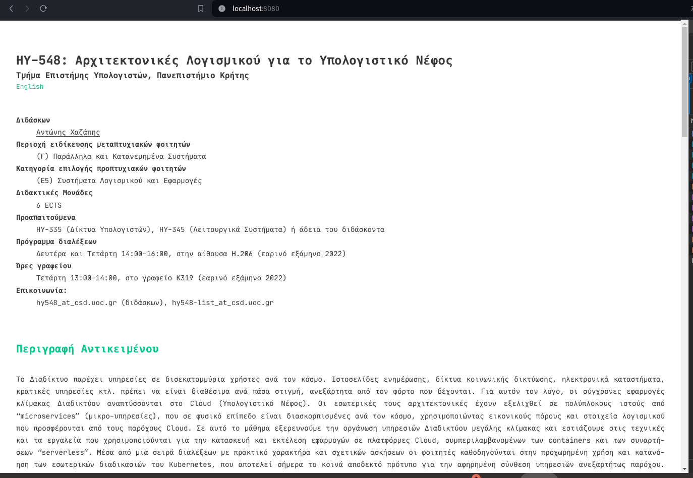

# Exercise 1
## a)
`docker pull nginx:1.23.3`

`docker pull nginx:1.23.3-alpine`
## b)
`nginx        1.23.3          ac232364af84   11 months ago   142MB`

`nginx        1.23.3-alpine   2bc7edbc3cf2   12 months ago   40.7MB`
## c)
`docker run -d -p 80:80 2bc7edbc3cf2`

`curl localhost:80`


<!DOCTYPE html>
<html>
<head>
<title>Welcome to nginx!</title>
<style>
html { color-scheme: light dark; }
body { width: 35em; margin: 0 auto;
font-family: Tahoma, Verdana, Arial, sans-serif; }
</style>
</head>
<body>
<h1>Welcome to nginx!</h1>
<p>If you see this page, the nginx web server is successfully installed and
working. Further configuration is required.</p>

<p>For online documentation and support please refer to
<a href="http://nginx.org/">nginx.org</a>.<br/>
Commercial support is available at
<a href="http://nginx.com/">nginx.com</a>.</p>

<p><em>Thank you for using nginx.</em></p>
</body>
</html>

## d)
`docker ps`

```
CONTAINER ID   IMAGE          COMMAND                  CREATED         STATUS         PORTS                               NAMES
4bd0d0386e90   2bc7edbc3cf2   "/docker-entrypoint.…"   2 minutes ago   Up 2 minutes   0.0.0.0:80->80/tcp, :::80->80/tcp   admiring_dewdney
```

## e)

`docker logs 4bd0d0386e90`

/docker-entrypoint.sh: /docker-entrypoint.d/ is not empty, will attempt to perform configuration
/docker-entrypoint.sh: Looking for shell scripts in /docker-entrypoint.d/
/docker-entrypoint.sh: Launching /docker-entrypoint.d/10-listen-on-ipv6-by-default.sh
10-listen-on-ipv6-by-default.sh: info: Getting the checksum of /etc/nginx/conf.d/default.conf
10-listen-on-ipv6-by-default.sh: info: Enabled listen on IPv6 in /etc/nginx/conf.d/default.conf
/docker-entrypoint.sh: Launching /docker-entrypoint.d/20-envsubst-on-templates.sh
/docker-entrypoint.sh: Launching /docker-entrypoint.d/30-tune-worker-processes.sh
/docker-entrypoint.sh: Configuration complete; ready for start up
2024/02/17 14:37:04 [notice] 1#1: using the "epoll" event method
2024/02/17 14:37:04 [notice] 1#1: nginx/1.23.3
2024/02/17 14:37:04 [notice] 1#1: built by gcc 12.2.1 20220924 (Alpine 12.2.1_git20220924-r4) 
2024/02/17 14:37:04 [notice] 1#1: OS: Linux 6.6.10-76060610-generic
2024/02/17 14:37:04 [notice] 1#1: getrlimit(RLIMIT_NOFILE): 1048576:1048576
2024/02/17 14:37:04 [notice] 1#1: start worker processes
2024/02/17 14:37:04 [notice] 1#1: start worker process 30
2024/02/17 14:37:04 [notice] 1#1: start worker process 31
2024/02/17 14:37:04 [notice] 1#1: start worker process 32
2024/02/17 14:37:04 [notice] 1#1: start worker process 33
2024/02/17 14:37:04 [notice] 1#1: start worker process 34
2024/02/17 14:37:04 [notice] 1#1: start worker process 35
2024/02/17 14:37:04 [notice] 1#1: start worker process 36
2024/02/17 14:37:04 [notice] 1#1: start worker process 37
2024/02/17 14:37:04 [notice] 1#1: start worker process 38
2024/02/17 14:37:04 [notice] 1#1: start worker process 39
2024/02/17 14:37:04 [notice] 1#1: start worker process 40
2024/02/17 14:37:04 [notice] 1#1: start worker process 41
2024/02/17 14:37:04 [notice] 1#1: start worker process 42
2024/02/17 14:37:04 [notice] 1#1: start worker process 43
2024/02/17 14:37:04 [notice] 1#1: start worker process 44
2024/02/17 14:37:04 [notice] 1#1: start worker process 45
172.17.0.1 - - [17/Feb/2024:14:37:15 +0000] "GET / HTTP/1.1" 200 615 "-" "curl/7.81.0" "-"


## f)

`docker stop 4bd0d0386e90`

## g)

`docker start 4bd0d0386e90`

## h)

`docker rm -f 4bd0d0386e90`

# Exercise 2

## a)

`docker run -d -p 80:80 2bc7edbc3cf2`

`docker exec -it crazy_brown /bin/sh`

`vi /usr/share/nginx/html/index.html`

`curl localhost:80`

<!DOCTYPE html>
<html>
<head>
<title>Welcome to MY nginx!</title>
<style>
html { color-scheme: light dark; }
body { width: 35em; margin: 0 auto;
font-family: Tahoma, Verdana, Arial, sans-serif; }
</style>
</head>
<body>
<h1>Welcome to MY nginx!</h1>
<p>If you see this page, the nginx web server is successfully installed and
working. Further configuration is required.</p>

<p>For online documentation and support please refer to
<a href="http://nginx.org/">nginx.org</a>.<br/>
Commercial support is available at
<a href="http://nginx.com/">nginx.com</a>.</p>

<p><em>Thank you for using nginx.</em></p>
</body>
</html>


## b)

`docker cp crazy_brown:/usr/share/nginx/html/index.html .`

i change the file title to HY548 and copy it back

`docker cp index.html crazy_brown:/usr/share/nginx/html/index.html`

`curl localhost:80`

<!DOCTYPE html>
<html>
<head>
<title>Welcome to MY nginx!</title>
<style>
html { color-scheme: light dark; }
body { width: 35em; margin: 0 auto;
font-family: Tahoma, Verdana, Arial, sans-serif; }
</style>
</head>
<body>
<h1>HY548</h1>
<p>If you see this page, the nginx web server is successfully installed and
working. Further configuration is required.</p>

<p>For online documentation and support please refer to
<a href="http://nginx.org/">nginx.org</a>.<br/>
Commercial support is available at
<a href="http://nginx.com/">nginx.com</a>.</p>

<p><em>Thank you for using nginx.</em></p>
</body>
</html>


## c)

I cant see the changes beacuse the my changes was only visible to the conteiner that it was running and stop. If i run the same container without delete it the changes will be there. But after delete changes are lost

# Exercise 3

`git clone https://github.com/chazapis/hy548.git`

`sudo apt install hugo`

`git submodule update --init --recursive`

`make all`

`docker run -d -p 8080:80 nginx:1.23.3-alpine`

`docker cp html/public 548a1a631b6d:/usr/share/nginx/html/`

Now i need to change the config in nginx to server from root public

`vi conf.d/default.conf`

```
 location / {
        root   /usr/share/nginx/html/public;
        index  index.html index.htm;
    }
```
after that i need to reload nginx 

`nginx -s reload`



# Exercise 4

## b)
`docker login`

`docker tag hy548:latest irodotos/hy548:latest`

`docker push irodotos/hy548:latest`

## c)

```
REPOSITORY   TAG             IMAGE ID       CREATED         SIZE
hy548        latest          c4547ade1968   2 minutes ago   143MB
nginx        1.23.3          ac232364af84   11 months ago   142MB
nginx        1.23.3-alpine   2bc7edbc3cf2   12 months ago   40.7MB
```
Now my alpine is like normal ngix beacuse i install the packages in my image.
Alpine is 40.7Mb and mine is 143Mb.


## d)

I remove all the uselles packages after i am done with them

# Exercise 5
