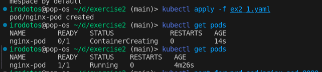
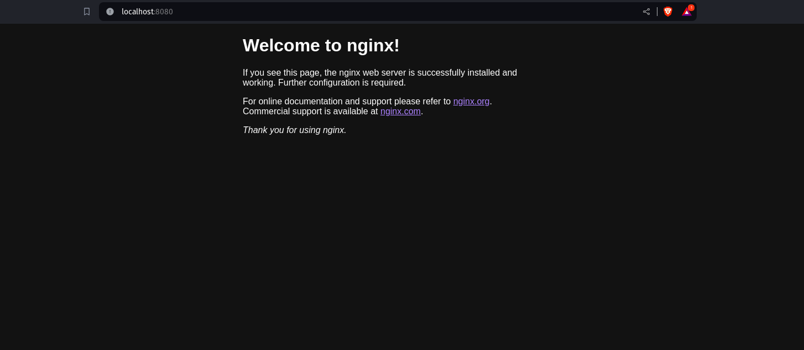
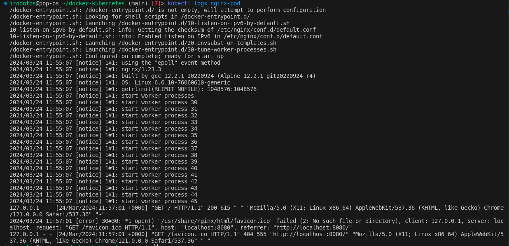
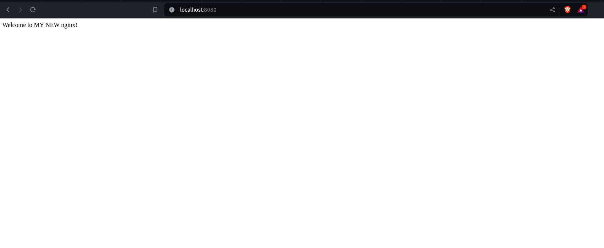

# Exercise 1
## a)
The yaml file is ex2_1.yaml
`kubectl apply -f ex2_1.yaml`

## b)
`kubectl port-forward pod/nginx-pod 8080:80`

## c)
`kubectl logs nginx-pod`

## d)
`kubectl exec -it nginx-pod -- /bin/sh`

`echo "Welcome to MY nginx!" > /usr/share/nginx/html/index.html`

## e)
`kubectl cp nginx-pod:/usr/share/nginx/html/index.html index.html`

i change it to have welcome to MY NEW NGINX

`kubectl cp index.html nginx-pod:/usr/share/nginx/html/index.html`

## f)
`kubectl delete -f ex2_1.yaml`

